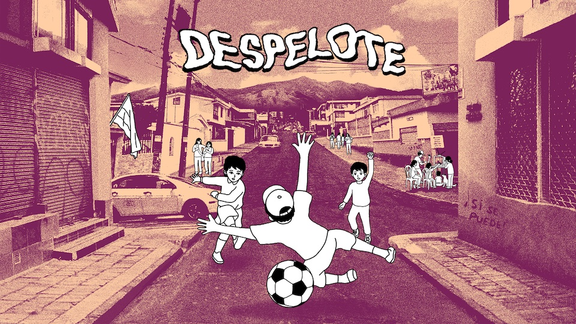
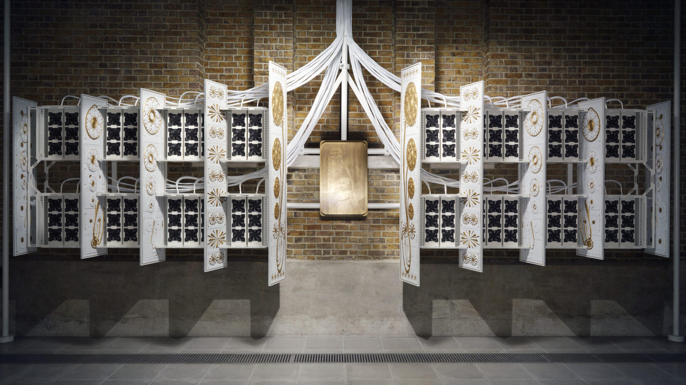
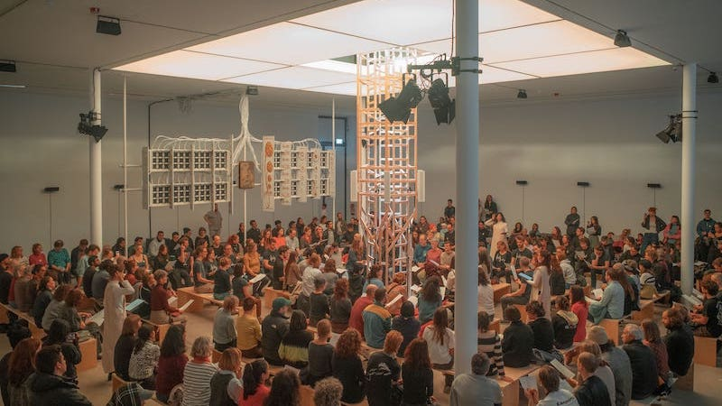
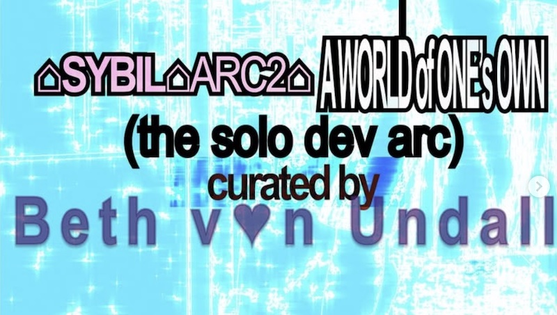

<!-- ###### recently -->

<section class="project-entry">
  

    
<a href="https://despelotegame.com">despelote</a> 
    Video game for PC/Mac and consoles 
    Interactive audio design, with a focus on urban ambience reproduction and improvisational dialogue.

    

      <input class="mobile-collapsible__toggle" type="checkbox" id="despelote-quotes-toggle" />
      <label class="mobile-collapsible__summary" for="despelote-quotes-toggle">quotes</label>
      

        <blockquote>
          
<em>it features some of the best sound work in recent memory, in the way its real sounds, wavelike, and recorded directly from that central park in Ecuador in the modern day, occasionally wash in and out of your periphery</em> 
          -chris tapsell, <a href="https://www.eurogamer.net/despelote-review">eurogamer</a>

        </blockquote>
        <blockquote>
          
<em>the game is earthy: Its defining sight and sound is perhaps that of scuffing feet on dry grass</em> 
          -lewis gordon, <a href="https://www.nytimes.com/2025/04/30/arts/despelote-soccer-ecuador.html">new york times</a>

        </blockquote>
      

    

  

  

    
    
  

</section>

<section class="project-entry">
  

    

      <a href="https://herndondryhurst.studio/">Herndon Dryhurst Studio</a> 
      Audio Engineer, Sound Designer & Researcher
      
        2025 : <a href="https://www.kw-berlin.de/en/exhibitions/holly-herndon-and-mat-dryhurst-starmirror">
          Starmirror - KW Berlin
          </a>
      
      
        2024 : <a href="https://www.kw-berlin.de/en/exhibitions/holly-herndon-and-mat-dryhurst-starmirror">
          The Call - Serpentine Gallery, London
        </a>
      
    

    

      <input class="mobile-collapsible__toggle" type="checkbox" id="herndon-details-toggle" />
      <label class="mobile-collapsible__summary" for="herndon-details-toggle">details</label>
      

        
Exhibitions working at the cutting edge of audio generation technology, developing a protocol for consensual training and reproduction of AI voice models.

        
Installation spaces utilize bespoke multichannel d&b audiotechnik soundsystems for playback, requiring custom mixes of singing, AI generated music, and field recordings. The spaces are rigged to record public training ceremonies.
        

        
Cleaned & mixed recordings are used to train experimental AI models in collaboration with IRCAM and the Algomus research group at Université de Lille. The documentation and results of this process are spatialized for each new exhibition. 
        

      

    

  

  

    
    
  

</section>

<section class="project-entry">
  

    
<a href="https://sybil.gg/">Sybil</a> 
    2026 ARC2 artist in residence 
  

  

    
  

</section>
